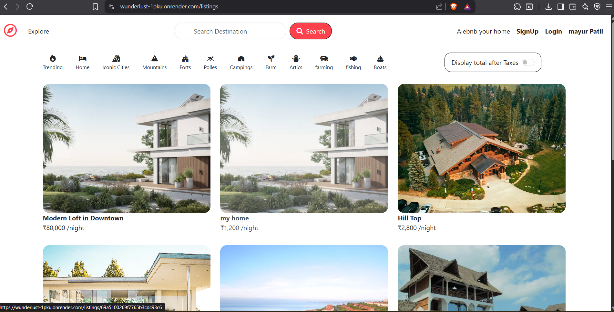
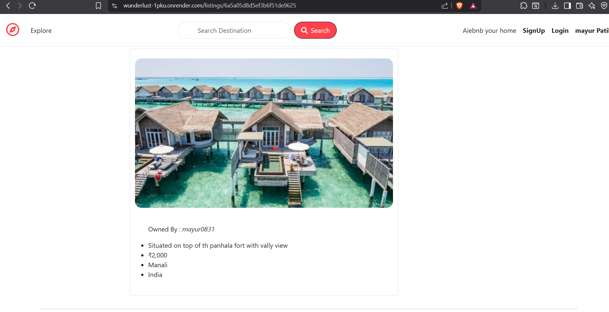
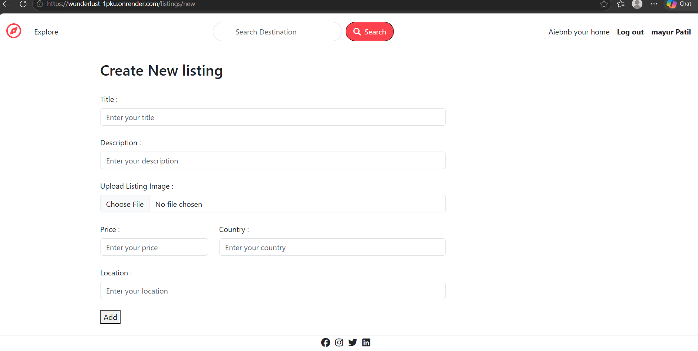
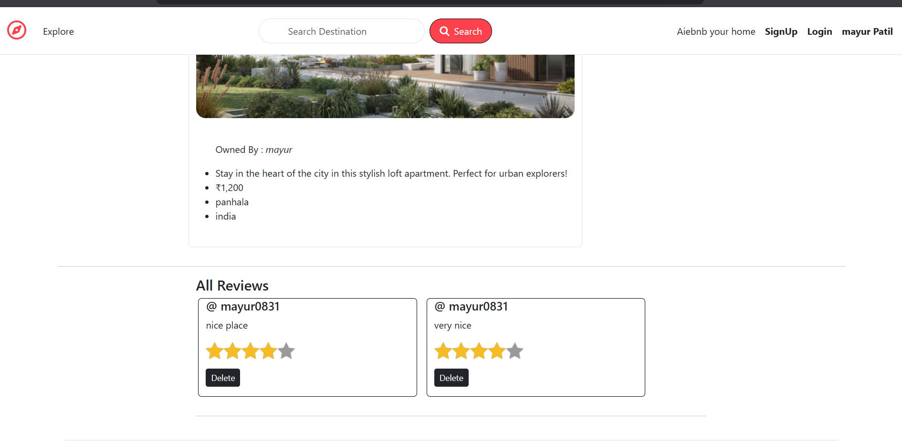
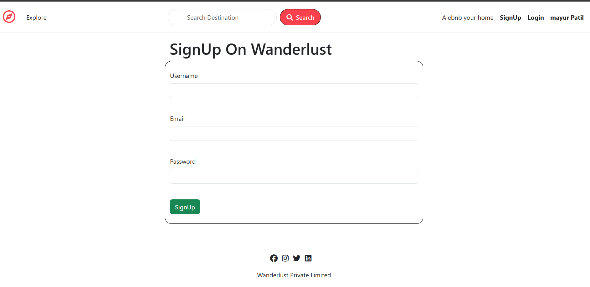

# 🏡 Wanderlust – Airbnb Clone

A full-stack accommodation booking platform inspired by Airbnb that allows users to discover, create, manage, and review travel stays. The application features secure authentication, image uploads, responsive design, and a seamless user experience.

---

## 🚀 Live Demo

🌐 **Live Website:**  
https://wunderlust-1pku.onrender.com/listings


# 📸 Project Screenshots

## 🏠 Home Page



---

## 🏡 Listing Details



---

## ➕ Add New Listing



---


## ⭐ Reviews



---


## 📝 Signup



---

# ✨ Features

### 👤 User Authentication
- Secure Signup and Login
- Passport.js Authentication
- Session Management
- Logout Functionality

### 🏡 Listings
- Create New Listings
- Edit Existing Listings
- Delete Listings
- View Listing Details

### 📷 Image Upload
- Cloudinary Integration
- Multer File Upload
- Secure Image Storage

### ⭐ Reviews
- Add Reviews
- Delete Reviews
- Star Rating System

### 🔒 Authorization
- Only Owners Can Edit/Delete Listings
- Protected Routes
- Middleware-based Authentication

### 🎨 User Interface
- Responsive Bootstrap Design
- Flash Messages
- Clean Navigation
- Mobile Friendly

---

# 🛠 Tech Stack

## Frontend

- HTML5
- CSS3
- Bootstrap 5
- EJS

## Backend

- Node.js
- Express.js

## Database

- MongoDB Atlas
- Mongoose

## Authentication

- Passport.js
- Passport Local
- Express Session

## File Storage

- Cloudinary
- Multer
- Multer Storage Cloudinary

## Deployment

- Render

---

# 📂 Project Structure

```
Wanderlust
│
├── controllers/
├── middleware.js
├── models/
├── public/
│   ├── css/
│   ├── js/
│   ├── images/
│
├── router/
├── screenshots/
├── util/
├── views/
│
├── cloudConfig.js
├── schema.js
├── app.js
├── package.json
├── README.md
└── .env
```

---

# ⚙️ Installation

## Clone Repository

```bash
git clone https://github.com/patilmayurviks/YOUR_GITHUB_REPO_LINK.git
```

---

## Navigate to Project

```bash
cd Wanderlust
```

---

## Install Dependencies

```bash
npm install
```

---

## Create Environment Variables

Create a `.env` file in the root directory.

```env
ATLASDB_URL=your_mongodb_connection_string

SECRET=your_secret_key

CLOUD_NAME=your_cloudinary_name

CLOUD_API_KEY=your_cloudinary_api_key

CLOUD_API_SECRET=your_cloudinary_api_secret
```

---

## Run the Application

```bash
npm start
```

Open:

```
http://localhost:8080/listings
```

---

# 🔐 Authentication Flow

- User Signup
- User Login
- Passport Authentication
- Session Creation
- Protected Routes
- Logout

---

# 📦 Database Collections

- Users
- Listings
- Reviews

---

# 📈 Future Enhancements

- 🔍 Search Functionality
- ❤️ Wishlist
- 📍 Interactive Maps
- 💳 Online Booking
- 📅 Availability Calendar
- 💬 Chat System
- 📧 Email Notifications
- 🌍 Multi-language Support

---

# 💡 Learning Outcomes

Through this project, I gained hands-on experience with:

- RESTful Routing
- MVC Architecture
- Authentication & Authorization
- Express Middleware
- MongoDB Relationships
- CRUD Operations
- Cloudinary Image Upload
- Session Management
- Deployment using Render
- Git & GitHub Workflow

---

# 👨‍💻 Author

## Mayur Patil

Computer Engineering Student

### GitHub

https://github.com/patilmayurviks

### LinkedIn

https://www.linkedin.com/in/mayur-patil-37436b326/

---

# ⭐ Support

If you found this project helpful, consider giving it a ⭐ on GitHub!

---

# 📄 License

This project is created for educational and portfolio purposes.
